## Reporting Completeness

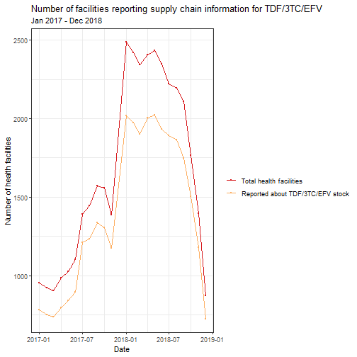

## Reporting Completeness

## Reporting completeness

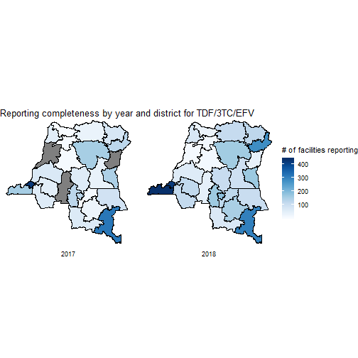

## Stockouts of first-line test kits 
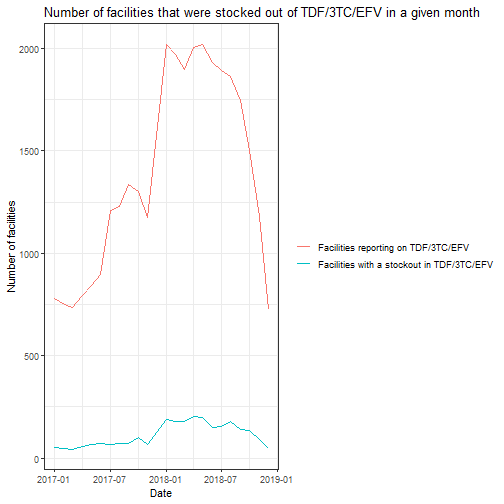

## Percentage of facilities stocked out of first-line test kits

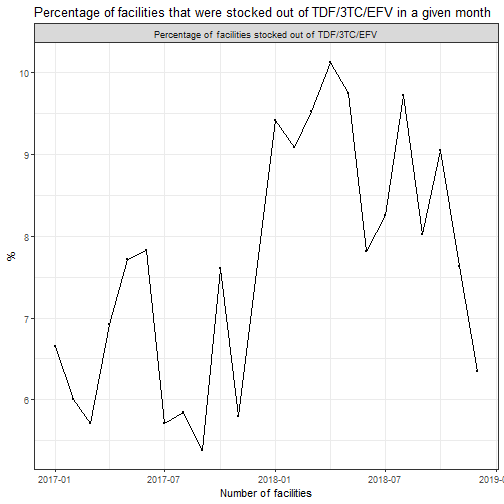

## Total days stocked out by facility

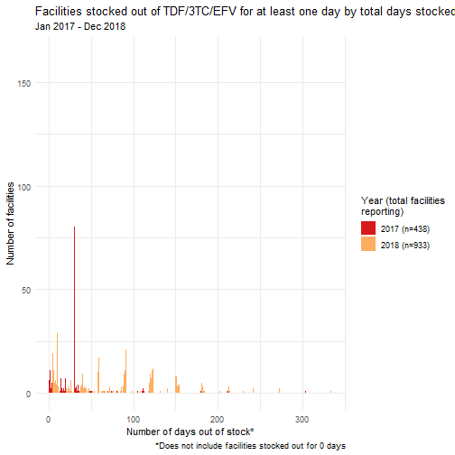

## Map of total facility-days of stockouts

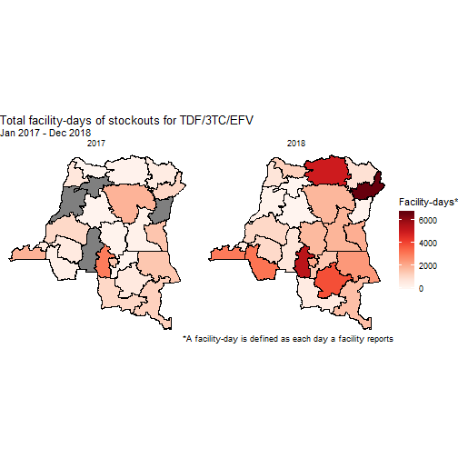

## Map of mean number of days stocked out

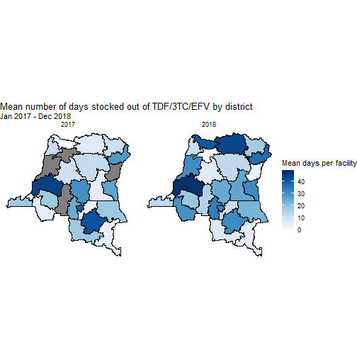

## Rate of change of stockouts

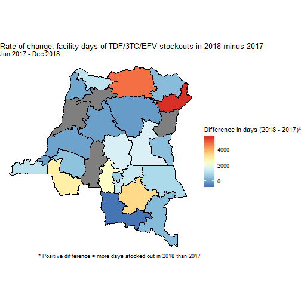

## Stock-out rate of change, by month

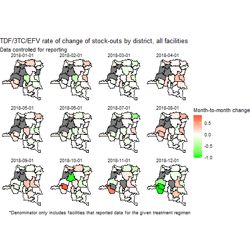

## Districts with more stockouts in 2018 than 2017

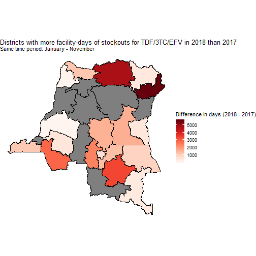

## Percentage of facility-days stocked out

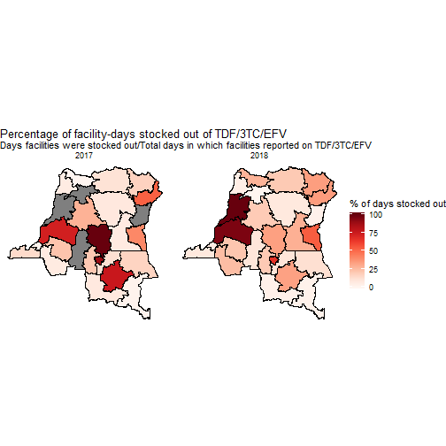

## Percentage of facility-days stocked out, 2018 only 

GRAPH WITH LABELS TO GO HERE 

## Days stocked out by facility level (all)

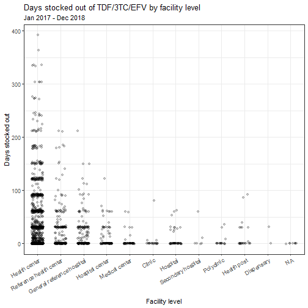

## Days stocked out by facility level (grouped)

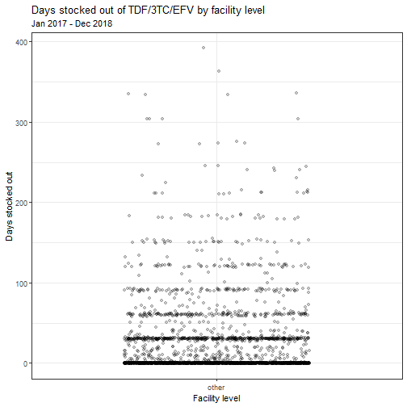

## Days stocked out by facility level (grouped, by year)

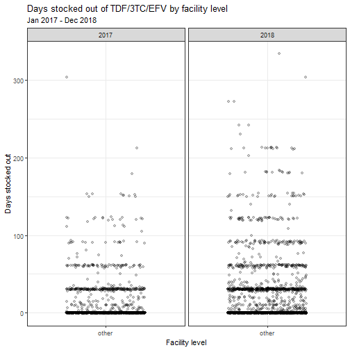

## Stock-out duration, 2017 (No stockouts - 2 MO)

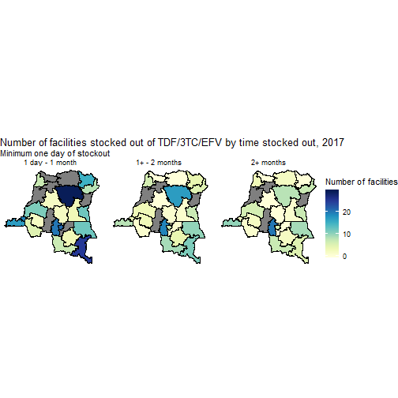

## Stock-out duration, 2017 (2-month intervals)

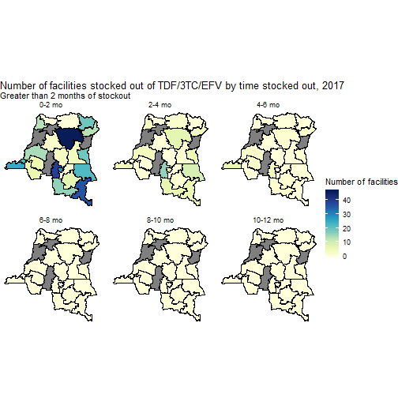

## Stock-out duration, 2018 (No stockouts - 2 MO)

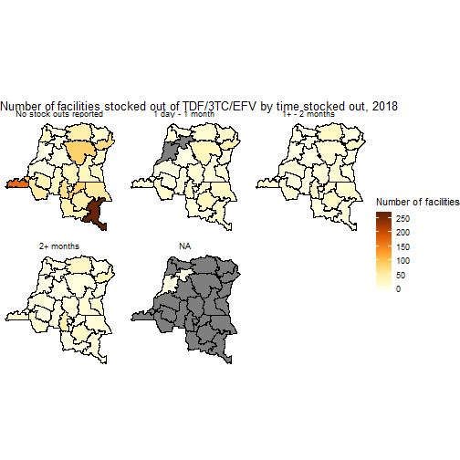

## Stock-out duration, 2018 (2-month intervals)

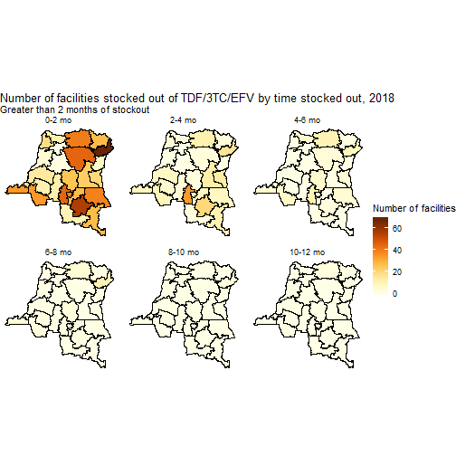

## Drug units per facility, by district

## Drug units per facility by district, 2018 only 

GRAPH WITH LABELS TO GO HERE 

## Facilities with a full month of stock-out, 2017

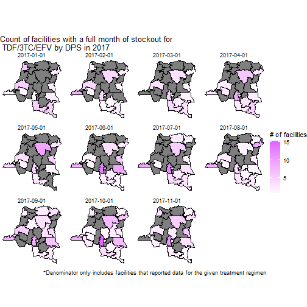

## Proportion of facilities stocked out for a whole month, 2017

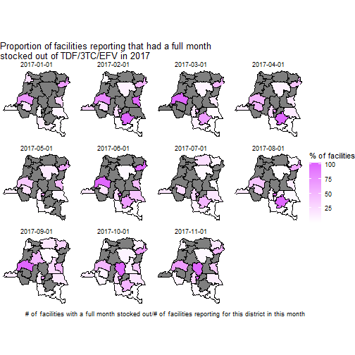

## Facilities with a full month of stock-out, 2018

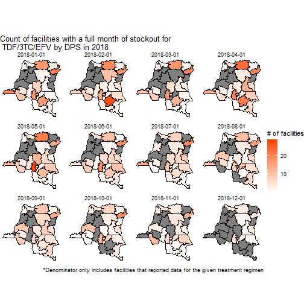

## Proportion of facilities stocked out for a whole month, 2018

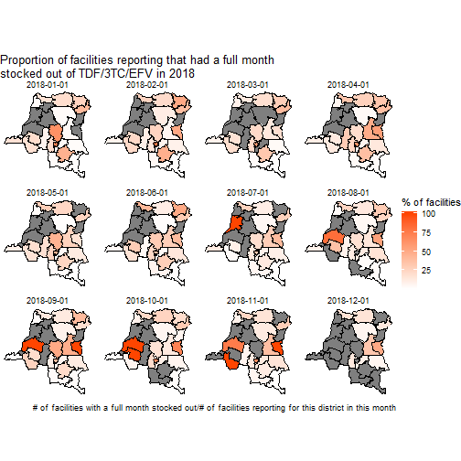
