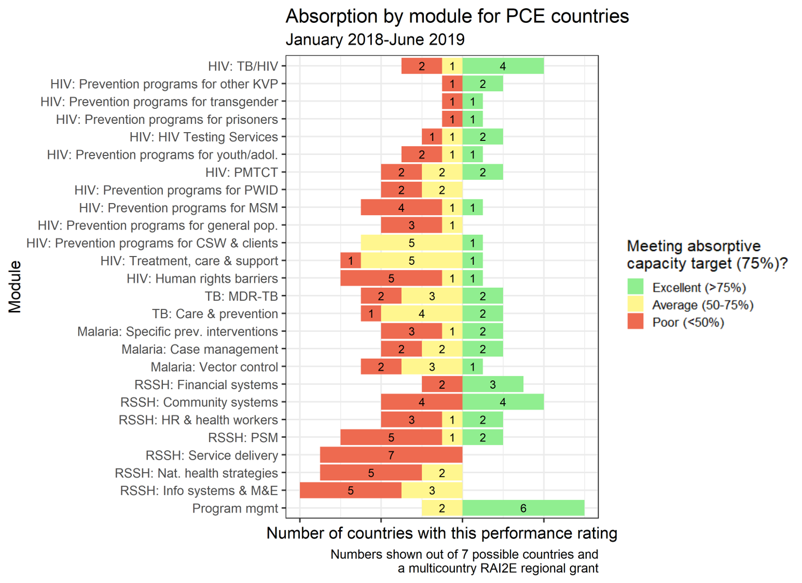

```{r setup, echo=FALSE, warning=FALSE, message=FALSE}
library(data.table) 
library(knitr)
library(ggplot2) 
library(scales)
knitr::opts_chunk$set(echo=FALSE, warning=FALSE, message=FALSE, fig.width=11, fig.height=8)

#-----------------------
# Prep data 
consortia_2018 = readRDS("J:/Project/Evaluation/GF/resource_tracking/visualizations/deliverables/Synthesis 2018/prepped_2018_data.rds")
consortia_2019 = readRDS("J:/Project/Evaluation/GF/resource_tracking/_other_data_sources/multi_country/2019-2020_synthesis/all_modules.rds")

# NAs and 0s aren't delineated in the 2018 cross consortia data. So, if budget is entered for a grant but all absorption is NA, assume it's 0. 
# EL 1/8/2020
consortia_2018[, budget:=as.numeric(budget)]
consortia_2018[, absorption:=as.numeric(absorption)]
check = consortia_2018[, .(budget=sum(budget, na.rm=T), absorption=sum(absorption, na.rm=T)), by='grant']
check = check[absorption==0] # Review these cases in the main dataset by hand. 
#View(consortia_2018[grant%in%c('SEN-M-PNLP', 'GTM-H-HIVOS (Q1-Q2 2018)', 'SDN-H-UNDP (Q1-Q2 2018)', 'GTM-T-MSPAS (Q3 2017)', 'SEN-Z-MOH')])
# Everything BUT SEN-H-UNDP has reported budget. 
consortia_2018[grant%in%c('SEN-M-PNLP', 'GTM-H-HIVOS (Q1-Q2 2018)', 'GTM-T-MSPAS (Q3 2017)', 'SEN-Z-MOH'), absorption:=0]

# Calculate expenditure number for 2018 data so it can be collapsed. 
consortia_2018[, budget:=as.numeric(budget)]
consortia_2018[, absorption:=as.numeric(absorption)]
consortia_2018[, expenditure:=budget*absorption]

# Tag RSSH specifically. 
rssh_mods = c("Community responses and systems", "Financial management systems", "Health management information system and monitoring and evaluation", 
              "Human resources for health, including community health workers", "Integrated service delivery and quality improvement", "National health strategies", 
              "Procurement and supply chain management systems")
consortia_2018[, disease:=tolower(grant_disease)]
consortia_2019[, disease:=tolower(grant_disease)]
consortia_2018[gf_module%in%rssh_mods, disease:='rssh']
consortia_2019[gf_module%in%rssh_mods, disease:='rssh']

# Also separate HIV/TB. 
hiv_mods = c("HIV Testing Services", "Programs to reduce human rights-related barriers to HIV services", 
             "Prevention of mother-to-child transmission", "Comprehensive prevention programs for sex workers and their clients", 
             "Comprehensive prevention programs for people who inject drugs and their partners", "Prevention programs for general population", 
             "Comprehensive prevention programs for transgender people", "Prevention programs for adolescents and youth, in and out of school", 
             "Program management", "TB/HIV", "Treatment, care & support", "Comprehensive prevention programs for men who have sex with men", 
             "Prevention programs for other vulnerable populations", "Treatment, care and support")
tb_mods = c('TB care and prevention', "Multidrug-resistant TB", "Comprehensive programs for people in prisons and other closed settings")
consortia_2018[gf_module%in%hiv_mods, disease:='hiv']
consortia_2019[gf_module%in%hiv_mods, disease:='hiv']
consortia_2018[gf_module%in%tb_mods, disease:='tb']
consortia_2019[gf_module%in%tb_mods, disease:='tb']

# Map 2018 data to abbreviated modules 
abbrev_mods = readRDS("J:/Project/Evaluation/GF/resource_tracking/modular_framework_mapping/all_interventions.rds")
setnames(abbrev_mods, c('module_eng', 'intervention_eng', 'abbrev_mod_eng', 'abbrev_int_eng'), c('gf_module', 'gf_intervention', 'abbrev_mod', 'abbrev_int'))
abbrev_mods = unique(abbrev_mods[, .(gf_module, abbrev_mod)])
consortia_2018[gf_module=="Treatment, care & support", gf_module:="Treatment, care and support"]
consortia_2018 = merge(consortia_2018, abbrev_mods, by=c('gf_module'), all=T)
stopifnot(nrow(consortia_2018[is.na(abbrev_mod)])==0)

# Standardize country variables. 
consortia_2018[country=="COD", loc_name:="DRC"]
consortia_2018[country=="UGA", loc_name:="Uganda"]
consortia_2018[country=="QSE", loc_name:="CAM/MYN"] # VERIFY THAT THIS IS CORRECT!! EL
consortia_2018[country=="MOZ", loc_name:="Mozambique"]
consortia_2018[country=="SEN", loc_name:="Senegal"]
consortia_2018[country=="SDN", loc_name:="Sudan"]
consortia_2018[country=="MMR", loc_name:="Myanmar"]
consortia_2018[country=="GTM", loc_name:="Guatemala"]
consortia_2018[country=="KHM", loc_name:="Cambodia"]

#Add time periods 
consortia_2018[, time_period:=0]
consortia_2019[, time_period:=1]

# Make variable names match, and remove irrelevant variables. 
consortia_2018$absorption <- NULL
consortia_2018$average_absorption <- NULL
setnames(consortia_2018, c('expenditure', 'budget'), c('cumulative_expenditure', 'cumulative_budget'))

dt = rbind(consortia_2018, consortia_2019, use.names=T, fill=T)
dt$time_period <- factor(dt$time_period, levels=c(0, 1), labels=c('Jan. 2018-Dec. 2018', 'Jan. 2018-June 2019'))
#---------------------------
# Source graphing functions
source("C:/Users/elineb/Documents/gf/resource_tracking/analysis/graphing_functions.r")
```

```{r generate_table} 
subset = dt[, .(budget=sum(cumulative_budget, na.rm=T), expenditure=sum(cumulative_expenditure, na.rm=T), original_budget=sum(original_budget)), by=c('loc_name', 'time_period', 'gf_module')] # We have a lot of unreported original budget, so leave out na.rm for this command. 
table = subset[, .(countries_reporting=.N, original_budget=sum(original_budget, na.rm=T)), by=c('gf_module', 'time_period')]
table[time_period=="Jan. 2018-Dec. 2018", original_budget:=NA]
absorption_range = subset[, .(absorption=round((expenditure/budget)*100, 1)), by=c('loc_name', 'time_period', 'gf_module')]
absorption_range[, min_absorption:=min(absorption, na.rm=T), by=c('time_period', 'gf_module')]
absorption_range[, max_absorption:=max(absorption, na.rm=T), by=c('time_period', 'gf_module')]
absorption_range[, mean_absorption:=mean(absorption, na.rm=T), by=c('time_period', 'gf_module')]
absorption_range = unique(absorption_range[, .(time_period, gf_module, mean_absorption, min_absorption, max_absorption)])
table = merge(table, absorption_range, by=c('time_period', 'gf_module'), all=T)

# Shape wide by time period. 
# cast = dcast(table, gf_module~time_period, value.var=c('countries_reporting', 'absorption', 'original_budget', 'min_absorption', 'max_absorption'))
write.csv(table, "C:/Users/elineb/Documents/gf/resource_tracking/analysis/deliverables/_Synthesis 2019 report analysis/cross_consortia/absorption_table.csv", row.names=F)

# Export data for both time periods. 
export = dt[, .(budget=sum(cumulative_budget, na.rm=T), expenditure=sum(cumulative_expenditure, na.rm=T)), by=c('loc_name', 'gf_module', 'time_period')]
export[, absorption:=round((expenditure/budget)*100, 1)]
saveRDS(export, "J:/Project/Evaluation/GF/resource_tracking/_other_data_sources/multi_country/2019-2020_synthesis/cross_consortia_aggregated.rds")
```

## Introduction 

This slide deck provides supporting evidence for the absorption findings presented in the 2019-2020 synthesis report (Section 3.1). Each finding is copied here, along with several supporting graphs. 

## Data sources 

The absorption data presented in this figures is cross-consortia (all eight PCE countries, with the exception of some Guatemala and regional grants) and represents the first eighteen months of grant implementation unless stated otherwise. 

All graphs showing "original, planned budget" show the original budget for a given module or country over the first eighteen months of the grant, as listed in the detailed budgets. 

The only grant period represented is 2018-2020, which excludes some Guatemala grants. 

## Finding statement 1, on overall funding by disease   
Funding for TB grants is much lower than for HIV or malaria grants across the entire PCE portfolio, despite evidence that TB burden is increasing. TB grants were awarded a total of $44.8 million, where malaria was awarded $503.8 million and HIV, HIV/TB grants were awarded $446.3 million.

## Evidence for statement 1: Original budget by grant disease 
```{r grant_budget} 
plot_data = dt[time_period=="Jan. 2018-June 2019", .(budget=sum(original_budget, na.rm=T)), by=c('grant_disease')]
plot_data[, grant_disease:=toupper(grant_disease)]
plot_data[grant_disease=="MALARIA", grant_disease:="Malaria"]
ggplot(plot_data, aes(x=grant_disease, y=budget, label=dollar(budget))) + 
  geom_bar(stat="identity", fill="forestgreen") + 
  geom_text(size=5) + 
  theme_bw(base_size=16) + 
  coord_flip() + 
  scale_y_continuous(labels=scales::dollar, limits=c(0, 600000000)) + 
  labs(title="Original budget by grant disease", x="Grant disease", y="Budget", subtitle="All PCE countries pooled", caption="*Data covers period from January 2018-June 2019")
``` 

## Evidence for statement 1: Absorption by grant disease, cumulative over first 18 months 
```{r 1a} 
plot_data = dt[time_period=="Jan. 2018-June 2019", .(budget=sum(cumulative_budget, na.rm=T), expenditure=sum(cumulative_expenditure, na.rm=T)), by=c('grant_disease')]
plot_data[, grant_disease:=toupper(grant_disease)]
plot_data[grant_disease=="MALARIA", grant_disease:="Malaria"]
budget_exp_bar(plot_data, xVar='grant_disease', altTitle="Absorption by grant disease", altSubtitle="January 2018-June 2019")
```

## Finding statement 2, on HIV key populations
Among prevention programs for target populations, “prevention programs for the general population” has the largest budget ($512,776/$20,037,622 or 3%) when all countries are pooled together. It also has the lowest expenditure of all of the key populations modules. However, this is mainly being driven by Uganda, which had a planned budget of $18.8 million for this module and has spent only $8,000. If Uganda is excluded from this module, the total expenditure is $504,554, or a 42% absorption rate. 

## Evidence for statement 2: Absorption for HIV key populations modules and PMTCT, pooled across countries 
```{r kp, echo=FALSE, results='hide', fig.keep='all', fig.height=7, fig.width=11}
hiv_absorption = dt[grant_disease%in%c("hiv", 'hiv/tb'), .(budget=sum(cumulative_budget, na.rm=T), expenditure=sum(cumulative_expenditure, na.rm=T)), by=c('abbrev_mod', 'time_period')]
hiv_absorption[grepl("prevention", tolower(abbrev_mod)), keep:=TRUE]
hiv_absorption[abbrev_mod=="PMTCT", keep:=TRUE]
hiv_absorption[abbrev_mod=="Care & prevention", keep:=FALSE]
hiv_absorption = hiv_absorption[keep==TRUE][order(expenditure/budget)]
plot = budget_exp_bar(hiv_absorption, facetVar='time_period', altTitle="Absorption for KP mods and PMTCT", orderVar='absorption', angleText=TRUE)
plot
```

## Evidence for statement 2: Absorption by module and country (included in report) 


## Evidence for statement 2: Original budget for "prevention programs for the general population" module, by country  
```{r gp_by_country, echo=FALSE, results='hide', fig.keep='all'} 
plot_data = dt[abbrev_mod=="Prevention programs for general pop.", .(budget=sum(cumulative_budget, na.rm=T), expenditure=sum(cumulative_expenditure, na.rm=T)), by=c('loc_name', 'time_period')]
# remove any cases where budget is 0 
plot_data = plot_data[budget!=0]
plot = budget_exp_bar(plot_data, xVar='loc_name', facetVar='time_period', altTitle="Absorption for prevention for the general population, by country", orderVar='absorption', angleText=TRUE)
plot

```

## Evidence for statement 2: Absorption for HIV key populations and PMTCT, excluding Uganda 
```{r kp_excl_uga, echo=FALSE, results='hide', fig.keep='all', fig.width=14}
hiv_absorption = dt[grant_disease%in%c("hiv", 'hiv/tb') & loc_name!= "Uganda", .(budget=sum(cumulative_budget, na.rm=T), expenditure=sum(cumulative_expenditure, na.rm=T)), by=c('abbrev_mod', 'time_period')]
hiv_absorption[grepl("prevention", tolower(abbrev_mod)), keep:=TRUE]
hiv_absorption[abbrev_mod=="PMTCT", keep:=TRUE]
hiv_absorption[abbrev_mod=="Care & prevention", keep:=FALSE]
hiv_absorption = hiv_absorption[keep==TRUE][order(expenditure/budget)]
plot = budget_exp_bar(hiv_absorption, facetVar='time_period', altTitle="Absorption for KP mods and PMTCT, excluding Uganda", orderVar='absorption', angleText=TRUE)
plot
```

## Finding statement 3, on human rights 

The module “preventing human rights-related barriers to HIV services” has had low absorption across all countries. Out of seven countries that included this module in their grants, five had absorption performance below 50%. 

## Evidence for statement 3: 5/7 countries have "poor" performance, or less than 50% absorption, for the human rights module


## Evidence for statement 3: Absorption for the human rights module, by country 
```{r human_rights}
plot_data = dt[abbrev_mod=="Human rights barriers", .(budget=sum(cumulative_budget), expenditure=sum(cumulative_expenditure)), by=c('abbrev_mod', 'loc_name', 'time_period')]
plot_data = plot_data[budget!=0]
print(budget_exp_bar(plot_data, xVar='loc_name', facetVar='time_period', altTitle="Human rights absorption (HIV) by country", angleText=TRUE))
```

## Finding statement 4, on absorption for malaria grants 
Although vector control has the largest overall budget of the malaria modules ($277 million), it is reporting an average absorption below 50% (47%, when pooled across all PCE countries). Some smaller interventions, like “Specific prevention interventions” (original budget: $4.4 million, absorption 82%) have reported higher absorption numbers. 

## Evidence for statement 4: Of the modules available in malaria grants, "vector control" has the highest planned budget
```{r malaria, fig.width=13}
plot_data = dt[grant_disease=="malaria" & time_period=="Jan. 2018-June 2019", .(budget=sum(original_budget, na.rm=T)), by='abbrev_mod']
ggplot(plot_data, aes(x=abbrev_mod, y=budget, label=dollar(budget))) + 
  geom_bar(stat="identity", fill="forestgreen") + 
  geom_text(size=5) + 
  theme_bw(base_size=16) + 
  coord_flip() + 
  scale_y_continuous(labels=scales::dollar, limits=c(0, 350000000)) + 
  labs(title="Original budget for malaria modules", x="Module", y="Budget", subtitle="All PCE countries pooled")
```

## Evidence for statement 4: Many malaria interventions with smaller budgets have higher absorption percentages than "vector control". 
```{r malaria2, fig.height=7} 
plot_data = dt[grant_disease=="malaria" , .(budget=sum(cumulative_budget, na.rm=T), expenditure=sum(cumulative_expenditure, na.rm=T)), by=c('abbrev_mod', 'time_period')]
print(budget_exp_bar(plot_data, xVar='abbrev_mod', facetVar='time_period', altTitle="Absorption for malaria modules", angleText=TRUE))
```

## Finding statement 5, on RSSH: 
“Health Management Information Systems and Monitoring & Evaluation” is the most frequently used RSSH module across PCE budgets and has the highest cumulative RSSH investment ($32 million, or 47.4% of all RSSH funding), which points to a promising national-level investment in information systems. However, absorption for this module has been mixed, with variability between grants. “Financial systems”, on the other hand, has much less investment across the PCE portfolio (4.4% of RSSH funding, or $2.9 million), which is problematic because it was found to be a common hindering factor for grant implementation. Although financial systems had limited investment, absorption for this module is relatively strong, at 91% over the first eighteen months of implementation. Another RSSH module with limited investment across the PCE portfolio has been “Community responses and systems”, with 2.5% of all RSSH investment, or $1.7 million.

## Evidence for statement 5: there are many more resources committed to "information systems and M+E" than to "financial management systems" or "community responses and systems".  
```{r rssh2, results='hide', fig.keep='all', fig.width=13, fig.height=7} 
rssh_mods = c("Info systems & M&E", "Financial systems", "HR & health workers", "Service delivery", "Nat. health strategies", "PSM", "Community systems")
plot_data = dt[abbrev_mod%in%rssh_mods & time_period=="Jan. 2018-June 2019", .(budget=sum(original_budget, na.rm=T)), by=c('abbrev_mod')]
# For supporting statistics to be written up in report text
plot_data[, total:=sum(budget)]
plot_data[, pct:=budget/total]
ggplot(plot_data, aes(x=abbrev_mod, y=budget, label=dollar(budget))) + 
  geom_bar(stat="identity", fill="forestgreen") + 
  geom_text() + 
  theme_bw(base_size=16) + 
  coord_flip() + 
  scale_y_continuous(labels=scales::dollar) + 
  labs(title="Original budget for RSSH modules", x="Module", y="Budget", subtitle="All PCE countries pooled")

```

## Evidence for statement 5: Absorption is higher for RSSH modules with lower budgets (as compared to other RSSH modules), which may suggest more absorptive capacity
```{r rssh3, results='hide', fig.keep='all', fig.height=7, fig.width=11} 
rssh_mods = c("Info systems & M&E", "Financial systems", "HR & health workers", "Service delivery", "Nat. health strategies", "PSM", "Community systems")
plot_data = dt[abbrev_mod%in%rssh_mods, .(budget=sum(cumulative_budget, na.rm=T), expenditure=sum(cumulative_expenditure, na.rm=T)), 
               by=c('abbrev_mod', 'time_period')]
budget_exp_bar(plot_data, facetVar='time_period', altTitle="Absorption for RSSH modules", altSubtitle="All contries pooled", orderVar='absorption', angleText=TRUE)

```

## Finding statement 6, on program management 
Absorption for program management has been high across virtually all grants, with six countries reporting absorption above 75%, and two countries reporting absorption between 50-75%. 

## Evidence for statement 6: All countries have average program management absorption above 50%. 


## Evidence for statement 6: Program managment absorption, by country
```{r pm, fig.width=13} 
plot_data = dt[abbrev_mod=="Program mgmt", .(budget=sum(cumulative_budget, na.rm=T), expenditure=sum(cumulative_expenditure, na.rm=T)), by=c('loc_name', 'time_period')]
print(budget_exp_bar(plot_data, xVar=c('loc_name'), facetVar='time_period', altTitle="Program management absorption, by country", angleText=TRUE, yScaleMax=80000000))
```
